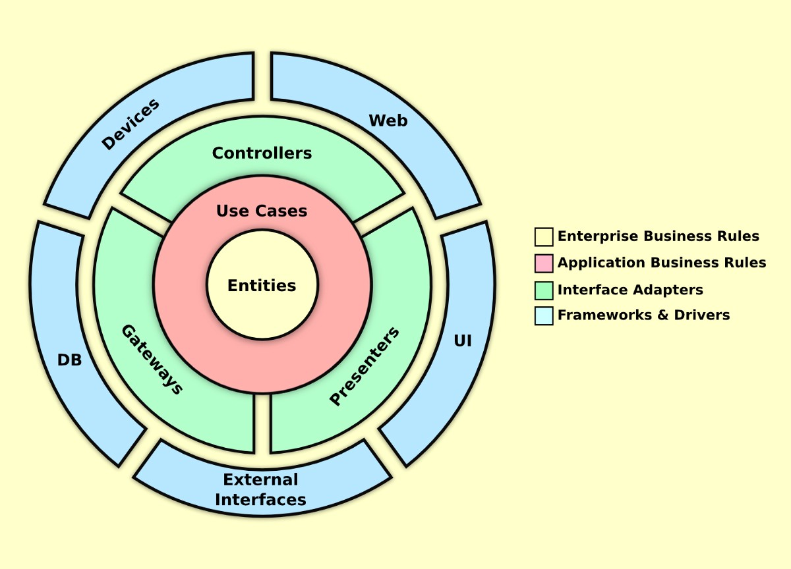

# Sobre

O projeto foi desenvolvido utilizando clean arquitecture com typescript, confesso que foi difícil fazer isso já que nunca tinha utilizado este tipo de arquitetura, já 
que estava acostumado com o padrão MVC (Model, view e controller). 

Mas este tipo de arquitetura busca se despreender de qualquer framework ou database assim tornando o sistema muito mais maleavel tornando assim muito fácil mudar de um mongodb pra um sqlite, ou pra um mysql ou postgress.

## o que foi utilizado no projeto? 
- Sqlite ( database )
- Typeorm 
- Express 
- Typescript
- Nodemailer
.
## Videos e projetos que vi antes de fazer esse
- <a href="https://github.com/otaviolemos/thewisedev-mailing">Otavio lemos the wise dev mailing<a/>
- <a href="https://github.com/rocketseat-content/youtube-api-node-solid">Rocketseat Api solid<a/>
